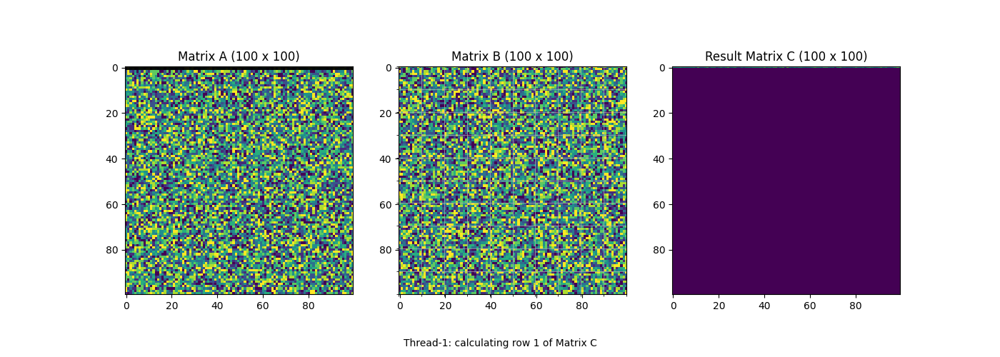

# Os_Task1

 Operating Systems Multithreading Assignment

##  Overview

This repository contains two tasks that demonstrate the use of threads and concurrent execution.

The two tasks are:

1. Producer-Consumer Problem using Java Threads
2. Matrix Multiplication using Python Threads and TensorFlow with Animation

The programs demonstrate important concepts such as thread creation, synchronization, shared resources, matrix computation, thread coordination, and visualization.

---

## Files in this Repository

| File | Description |
| --- | --- |
| `ProducerConsumerDemo.java` | Java implementation of the Producer-Consumer problem |
| `matrix_multiplication_threads_.py` | Python implementation of matrix multiplication using threads and TensorFlow |
| `matrix_multiplication.gif` | Animation of the matrix multiplication process |
| `README.md` | Project documentation |

---

## 1. Producer-Consumer Problem

##  Objective

To implement the Producer-Consumer problem using Java threads and synchronization.

##  Description

The Producer-Consumer problem uses a shared bounded buffer.

- Producers add items to the buffer.
- Consumers remove items from the buffer.
- The buffer has a fixed capacity.
- If the buffer is full, the producer waits.
- If the buffer is empty, the consumer waits.
- Synchronization is used to safely access the shared buffer.

##  Working

The program uses a `BoundedBuffer` class to store items.

The buffer operations are declared as:

```java
synchronized
```

This allows only one thread at a time to perform an operation on the shared buffer.

When the buffer is full, the producer waits using:

```java
wait();
```

When the buffer is empty, the consumer waits using:

```java
wait();
```

After adding or removing an item, waiting threads are notified using:

```java
notifyAll();
```

The program also uses:

```java
join();
```

to wait for all producer and consumer threads to complete.

##  Concepts Used

- Java Threads
- `Runnable`
- `Thread`
- Bounded Buffer
- Shared Resource
- Synchronization
- `synchronized`
- `wait()`
- `notifyAll()`
- `join()`

##  How to Run

### Using Eclipse

1. Create a Java project.
2. Create the package `ostask`.
3. Add `ProducerConsumerDemo.java`.
4. Open the file.
5. Run it as a Java Application.
6. Enter the required values in the Console.

### Using Terminal

Compile:

```bash
javac -d . ProducerConsumerDemo.java
```

Run:

```bash
java ostask.ProducerConsumerDemo
```

##  Sample Input

```text
Enter buffer capacity: 3
Enter number of producers: 2
Enter number of consumers: 2
Enter items produced by each producer: 2
```

##  Sample Output

```text
Consumer-1 is waiting - buffer is empty.

Producer-2 added 201 | Current items: 1
Producer-1 added 101 | Current items: 2
Consumer-2 removed 201 | Current items: 1
Consumer-1 removed 101 | Current items: 0

Producer-1 added 102 | Current items: 1
Producer-2 added 202 | Current items: 2
Consumer-1 removed 102 | Current items: 1
Consumer-2 removed 202 | Current items: 0

Producer-Consumer execution completed.
```

> The order of messages can change because multiple threads execute concurrently.

---

# 2️. Matrix Multiplication Using Threads + TensorFlow

##  Objective

To implement multiplication of two matrices with a minimum size of **100 × 100 using threads and TensorFlow**, and demonstrate the working using animation.

##  Description

The program creates two matrices:

```text
Matrix A = 100 × 100
Matrix B = 100 × 100
```

The result is stored in:

```text
Matrix C = A × B
```

The program uses **4 threads** to perform the matrix multiplication.

##  Working

The 100 rows are divided among 4 threads.

```text
Thread-1 → Rows 1 to 25
Thread-2 → Rows 26 to 50
Thread-3 → Rows 51 to 75
Thread-4 → Rows 76 to 100
```

Each thread processes its assigned rows.

For each element of Matrix C, the program takes one row from Matrix A and one column from Matrix B.

The multiplication is performed using TensorFlow:

```python
tf.reduce_sum(row * column)
```

The calculated value is stored in the corresponding position of Matrix C.

After all threads finish, the program waits for them using:

```python
thread.join()
```

##  Thread Creation

The program creates threads using:

```python
threading.Thread
```

Each thread is given a starting row and ending row.

Since the threads run concurrently, their completion order can be different in each execution.

For example:

```text
Thread-4 completed rows 76 to 100
Thread-1 completed rows 1 to 25
Thread-3 completed rows 51 to 75
Thread-2 completed rows 26 to 50
```

##  Result Verification

After the threaded matrix multiplication is completed, TensorFlow is used to calculate the matrix multiplication independently using:

```python
tf.matmul()
```

The two results are compared using:

```python
np.allclose()
```

If the results match, the program displays:

```text
Result verification: SUCCESS
```

This confirms that the threaded matrix multiplication produced the correct result.

---

#  Animation

The program creates an animation using **Matplotlib**.

The animation contains three panels:

- Matrix A
- Matrix B
- Result Matrix C

The current row is highlighted in Matrix A.

The result matrix is displayed gradually row by row.

The animation also displays which thread is responsible for the current row.

The animation is saved as:

```text
matrix_multiplication.gif
```

##  Matrix Multiplication Animation



---

##  Concepts Used

- Python Multithreading
- `threading.Thread`
- `thread.join()`
- TensorFlow
- NumPy
- Matrix Multiplication
- `tf.reduce_sum()`
- `tf.matmul()`
- Matplotlib
- `FuncAnimation`
- `PillowWriter`
- GIF Animation

##  Installation

Install the required Python libraries:

```bash
pip install tensorflow numpy matplotlib pillow
```

##  How to Run

Run the Python program using:

```bash
python matrix_multiplication_threads_.py
```

The program will:

1. Create two 100 × 100 matrices.
2. Create four threads.
3. Divide the rows among the threads.
4. Perform matrix multiplication.
5. Wait for all threads to complete.
6. Verify the result using TensorFlow.
7. Create the animation.
8. Save the animation as `matrix_multiplication.gif`.

##  Sample Output

```text
Thread-4 completed rows 76 to 100
Thread-1 completed rows 1 to 25
Thread-3 completed rows 51 to 75
Thread-2 completed rows 26 to 50

Matrix multiplication completed.
Matrix A size: (100, 100)
Matrix B size: (100, 100)
Number of threads: 4
Result verification: SUCCESS
Creating animation...
Animation saved as: matrix_multiplication.gif
Program completed successfully.
```

> The order of thread completion may change between runs because thread scheduling can be different in each execution.

---

#  Technologies Used

| Technology | Purpose |
| --- | --- |
| Java | Producer-Consumer implementation |
| Java Threads | Producer and Consumer execution |
| Synchronization | Safe access to the shared buffer |
| Python | Matrix multiplication |
| Python `threading` | Multithreaded computation |
| TensorFlow | Matrix calculation and verification |
| NumPy | Matrix creation and result comparison |
| Matplotlib | Animation |
| Pillow | GIF generation |

---

#  Requirements

##  Java

- JDK 8 or above
- Eclipse or any Java IDE

##  Python

- Python 3.x
- TensorFlow
- NumPy
- Matplotlib
- Pillow

Install the required Python packages:

```bash
pip install tensorflow numpy matplotlib pillow
```

---

#  Learning Outcomes

Through these tasks, the following concepts are demonstrated:

- Thread creation and execution
- Concurrent execution
- Producer-Consumer communication
- Shared resources
- Synchronization
- `wait()` and `notifyAll()`
- Thread coordination using `join()`
- Dividing matrix computation among threads
- TensorFlow operations
- Result verification
- Animation and visualization

---

#  Conclusion

This assignment demonstrates multithreading through two different programs.

The **Producer-Consumer program** shows how multiple threads can safely work with a shared bounded buffer using synchronization.

The **Matrix Multiplication program** shows how matrix computation can be divided among multiple threads. TensorFlow is used for the numerical calculation and verification, while Matplotlib and Pillow are used to create the animation.

Both programs were successfully implemented and tested.
